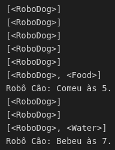

# Exercício - criando o primeiro agente em Python

## 1) Crie um agente em Python, e um ambiente, que sejam similares ao que foi apresentado em sala de aula, gerando um resultado semelhante ao que pode ser visto na figura abaixo:

